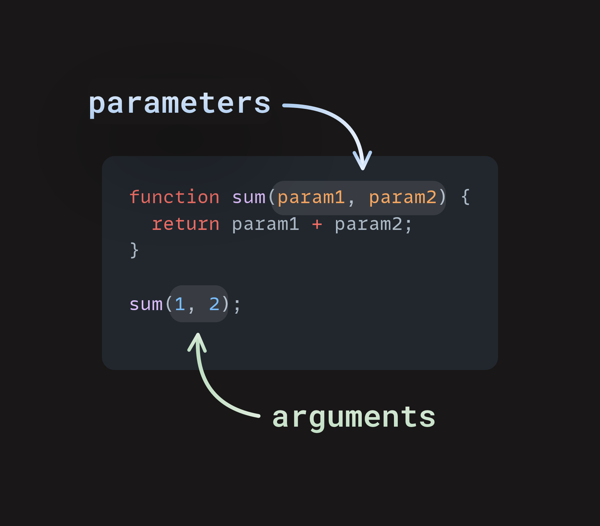

# 8. JavaScript

## Variables

Variables in JS can be declared using `let` or `const` (for constants):

```JS
let message;

message = 'Hello!';

message = 'World!'; // value changed

alert(message);
```

```JS
let user = 'John', age = 25, message = 'Hello';
```

```JS
const myBirthday = '18.04.1982';

myBirthday = '01.01.2001'; // error, can't reassign the constant!
```

```JS
const COLOR_RED = "#F00";
const COLOR_GREEN = "#0F0";
const COLOR_BLUE = "#00F";
const COLOR_ORANGE = "#FF7F00";

// ...when we need to pick a color
let color = COLOR_ORANGE;
alert(color); // #FF7F00
```

Some naming conventions:

- Use camelCase

- Use human-readable names (e.g. use `userName` instead of `a`)

## Numbers

- Arithmetic operators: `+` (addition), `-` (subtraction), `*` (multiplication), `/` (division), `%` (modulo), `**` (exponent)

- Increment and decrement operators: `++` (increment), `--` (decrement)

- Assignment operators: `=` (assignment), `+=` (addition assignment), `-=` (subtraction assignment), `*=` (multiplication assignment), `/=` (division assignment)

- Comparison operators: `==` (equality), `!=` (inequality), `===` (strict equality), `!==` (strict inequality), `<` (less than), `>` (greater than), `<=` (less than or equal to), `>=` (greater than or equal to)

- Useful methods: `toFixed()` (rounding)

- Special values: `Infinity`, `NaN`

## Data Types and Conditionals

- Data types:

  - Primitive: `number`, `bigint`, `string`, `boolean`, `null`, `undefined`, `symbol`

  - Non-primitive: `object`

- `typeof` returns the type of the operand. `type of undefined` returns `"undefined"`. `typeof null` returns `"object"` (this is an error).

- Logical operators: `||` (OR), `&&` (AND), `!` (NOT)

- If/else statements:

```JS
if (condition) {
  /* code to run if condition is true */
} else if{
  /* run some other code instead */
} else {
  /* run some other code instead */
}
```

- Switch statements:

```JS
switch (expression) {
  case choice1:
    // run this code
    break;

  case choice2:
    // run this code instead
    break;

  // include as many cases as you like

  default:
    // actually, just run this code
    break;
}
```

- Ternary operator:

```JS
condition ? trueExpression : falseExpression
```

- Falsy values: `0`, `""`, `null`, `undefined`, `NaN`

## Chrome DevTools

- To open DevTools, use `option` + `command` + `C`. To open console, use `option` + `command` + `J`.

- **Device mode** can be used to simulate websites on other devices.

- To find where bugs are in your code, use **breakpoints**. [This doc](https://developer.chrome.com/docs/devtools/javascript/breakpoints) sums up every type of breakpoints in DevTools.

- To test functions, use `console.log()`. To clear the console, use `console.clear()`.

## Functions

A function takes in parameters and produces outputs. When you make a function call, the inputs are called arguments.



```JS
let func = function(param1, param2, ..., paramN) {
  return expression;
};
```

A function may neither have parameters nor return a value (i.e. simply execute a task):

```JS
function sayHello(){
  alert("Hello!");
}
```

A very efficient way to write functions is by using arrow functions:

```JS
let func = (arg1, arg2, ..., argN) => expression;
```

```JS
let sum = (a, b) => a + b;

/* This arrow function is a shorter form of:

let sum = function(a, b) {
  return a + b;
};
*/

alert( sum(1, 2) ); // 3
```

It is highly recommended to use clear and descriptive names for your functions (e.g. `getAge()` instead of `$()`).

## Problem Solving and Understanding Errors

Here are three recommended steps to solve programming problems:

1. Plan:
   Use comments to write down the necessary requirements to solve the problem (i.e. dissect the problem statement).

2. Pseudocode
   Write a legible pseudocode of how the program should work.

3. Divide and conquer
   Solve each subproblem (i.e. step) one by one.

Here are the common types of errors in JS:

1. [Syntax errors](https://developer.mozilla.org/en-US/docs/Web/JavaScript/Reference/Global_Objects/SyntaxError)

2. [Reference errors](https://developer.mozilla.org/en-US/docs/Web/JavaScript/Reference/Global_Objects/ReferenceError)

3. [Type errors](https://developer.mozilla.org/en-US/docs/Web/JavaScript/Reference/Global_Objects/TypeError)

   Type errors happen when

   - an operand or argument passed to a function is incompatible with the type expected by that operator or function;

   - or when attempting to modify a value that cannot be changed;

   - or when attempting to use a value in an inappropriate way.

4. Logic errors

## Arrays and Loops

Some (potentially) important array methods:

- Add an element to the end of an array: `push()`

- Convert an array into a string: `toString()`

- Sort an array: `sort()`

There are 4 types of loops:

- for...of:

  ```JS
  for (const item of array) {
    // code to run
  }
  ```

- for:

  ```JS
  for (initializer; condition; final-expression) {
  // code to run
  }
  ```

- while:

  ```JS
  initializer
  while (condition) {
    // code to run

    final-expression
  }
  ```

- do...while:

  ```JS
  initializer
  do {
    // code to run

    final-expression
  } while (condition)
  ```

Some notes:

- `break` breaks a loop completely. `continue` skips to the next iteration of the loop.

- To `break` an outer loop, use a label:

  ```JS
  label: {
    // ...
    break label; // works
    // ...
  }
  ```

## DOM Manipulation

The **Document Object Model (DOM)** is a tree-oriented representation of a webpage.

For example, the below code shows a DOM tree with "container" being the **parent** of its **children** nodes "display" and "controls".

```HTML
<div id="container">
  <div class="display"></div>
  <div class="controls"></div>
</div>
```

There are two ways to target nodes in the DOM model:

1. CSS selectors:

   To select `<div class="display"></div>`, we can write:

   - div.display
   - .display
   - #container > .display
   - div#container > div.display

2. Relational selectors:

   ```JS
   // selects the #container div
   const container = document.querySelector("#container");

   // selects the first child of #container => .display
   console.dir(container.firstElementChild);

   // selects the .controls div
   const controls = document.querySelector(".controls");

   // selects the prior sibling => .display
   console.dir(controls.previousElementSibling);
   ```

Here are some DOM methods:

1. Query selectors:

   - `element.querySelector(selector)` returns a reference to the first match of _selector_.

   - `element.querySelectorAll(selectors)` returns a NodeList containing references to all the matches of the _selectors_.

2. Element creation:

   `document.createElement(tagName, [options])` creates a new element of tag type tagName.

   ```JS
   const div = document.createElement("div");
   ```

3. Append elements:

   - `parentNode.appendChild(childNode)` appends _childNode_ as the last child of _parentNode_.

   - `parentNode.insertBefore(newNode, referenceNode)` inserts _newNode_ into _parentNode_ before _referenceNode_.

4. Remove elements:

   - `parentNode.removeChild(child)` removes child from _parentNode_ on the DOM and returns a reference to _child_.

5. Altering elements:

   ```JS
   // creates a new div referenced in the variable 'div'
   const div = document.createElement("div");
   ```

6. Adding inline style:

   ```JS
   // adds the indicated style rule to the element in the div variable
   div.style.color = "blue";

   // adds several style rules
   div.style.cssText = "color: blue; background: white;";

   // adds several style rules
   div.setAttribute("style", "color: blue; background: white;");
   ```

   ```JS
   // dot notation with kebab-case: doesn't work as it attempts to subtract color from div.style.background
   // equivalent to: div.style.background - color
   div.style.background-color;

   // dot notation with camelCase: works, accesses the div's background-color style
   div.style.backgroundColor;

   // bracket notation with kebab-case: also works
   div.style["background-color"];

   // bracket notation with camelCase: also works
   div.style["backgroundColor"];
   ```

7. Editing attributes

   ```JS
   // if id exists, update it to 'theDiv', else create an id with value "theDiv"
   div.setAttribute("id", "theDiv");

   // returns value of specified attribute, in this case "theDiv"
   div.getAttribute("id");

   // removes specified attribute
   div.removeAttribute("id");
   ```

8. Working with classes:

   ```JS
   // adds class "new" to your new div
   div.classList.add("new");

   // removes "new" class from div
   div.classList.remove("new");

   // if div doesn't have class "active" then add it, or if it does, then remove it
   div.classList.toggle("active");
   ```

9. Adding text content:

   ```JS
   // creates a text node containing "Hello World!" and inserts it in div
   div.textContent = "Hello World!";
   ```

10. Adding HTML content:

    ```JS
    // renders the HTML inside div
    div.innerHTML = "<span>Hello World!</span>";

    // Note: textContent is preferred over innerHTML
    ```

## Events

**Events** are actions that occur on your webpage, such as mouse-clicks or key-presses.

There are 3 main ways to handle events:

1. Specify function attributes directly on HTML elements:

   ```HTML
   <button onclick="alert('Hello World')">Click Me</button>
   ```

2. Set properties using `on<eventType>` in JS:

   ```HTML
   <!-- the HTML file -->
   <button id="btn">Click Me</button>
   ```

   ```JS
   // the JavaScript file
    const btn = document.querySelector("#btn");
    btn.onclick = () => alert("Hello World");
   ```

3. Attach event listeners to DOM nodes in JS:

   ```HTML
   <!-- the HTML file -->
   <button id="btn">Click Me Too</button>
   ```

   ```JS
   // the JavaScript file
    const btn = document.querySelector("#btn");
    btn.addEventListener("click", () => {
      alert("Hello World");
    });
   ```

All 3 methods can be used with named functions:

```HTML
<!-- the HTML file -->
<!-- METHOD 1 -->
<button onclick="alertFunction()">CLICK ME BABY</button>
```

```JS
// the JavaScript file
// METHOD 1
function alertFunction() {
  alert("YAY! YOU DID IT!");
}
```

```HTML
<!-- the HTML file -->
<!-- METHODS 2 & 3 -->
<button id="btn">CLICK ME BABY</button>
```

```JS
// the JavaScript file
// METHODS 2 & 3
function alertFunction() {
  alert("YAY! YOU DID IT!");
}
const btn = document.querySelector("#btn");

// METHOD 2
btn.onclick = alertFunction;

// METHOD 3
btn.addEventListener("click", alertFunction);
```

Use `function(e)`, which passes in the event `e` as a parameter:

```JS
btn.addEventListener("click", function (e) {
  console.log(e);
});
```

```JS
btn.addEventListener("click", function (e) {
  console.log(e.target);
});
```

```JS
btn.addEventListener("click", function (e) {
  e.target.style.background = "blue";
});
```

Attach listeners to a group of nodes:

```HTML
<div id="container">
  <button id="1">Click Me</button>
  <button id="2">Click Me</button>
  <button id="3">Click Me</button>
</div>
```

```JS
// buttons is a node list. It looks and acts much like an array.
const buttons = document.querySelectorAll("button");

// we use the .forEach method to iterate through each button
buttons.forEach((button) => {
  // and for each one we add a 'click' listener
  button.addEventListener("click", () => {
    alert(button.id);
  });
});
```

Here is an example of a custom event:

```HTML
<!DOCTYPE html>
<html lang="en">
<head>
    <meta charset="UTF-8">
    <meta name="viewport" content="width=device-width, initial-scale=1.0">
    <title>JavaScript Custom Event</title>
</head>
<body>
    <div class="note">JS Custom Event</div>
    <script>
        // Add highlight event
        function highlight(elem) {
            const bgColor = 'yellow';
            elem.style.backgroundColor = bgColor;

            // create the event
            let event = new CustomEvent('highlight', {
                detail: {
                    backgroundColor: bgColor
                }
            });
            // dispatch the event
            elem.dispatchEvent(event);
        }

        // Select the div element
        let div = document.querySelector('.note');

        // Add border style
        function addBorder(elem) {
            elem.style.border = "solid 1px red";
        }

        // Listen to the highlight event
        div.addEventListener('highlight', function (e) {
            addBorder(this);

            // examine the background
            console.log(e.detail);
        });

        // highlight div element
        highlight(div);
    </script>
</body>
</html>
```

## Objects

An **object** is a collection of key-value pairs (known as _properties_).

```JS
let user = {     // an object
  name: "John",  // by key "name" store value "John"
  age: 30        // by key "age" store value 30
};

// get property values of the object:
alert( user.name ); // John
alert( user.age ); // 30

// add property isAdmin to user
user.isAdmin = true;

// remove property age from user
delete user.age;
```

We can square brackets to access long string properties:

```JS
let user = {
  name: "John",
  age: 30
};

let key = prompt("What do you want to know about the user?", "name");

// access by variable
alert( user[key] ); // John (if enter "name")
```

We can use the `in` operator to find whether a property exists in an object:

```JS
let user = { age: 30 };

let key = "age";
alert( key in user ); // true, property "age" exists
```

We can also use `in` to iterate an object:

```JS
let user = {
  name: "John",
  age: 30,
  isAdmin: true
};

for (let key in user) {
  // keys
  alert( key );  // name, age, isAdmin
  // values for the keys
  alert( user[key] ); // John, 30, true
}
```

There are three advanced array methods that are commonly used:

- `.map()`:

  ```JS
  const arr = [1, 2, 3, 4, 5];
  const mappedArr = arr.map((num) => num + 1);
  console.log(mappedArr); // Outputs [2, 3, 4, 5, 6]
  ```

- `.filter()`:

  ```JS
  function isOdd(num) {
    return num % 2 !== 0;
  }
  const arr = [1, 2, 3, 4, 5];
  const oddNums = arr.filter(isOdd);
  console.log(oddNums); // Outputs [1, 3, 5];
  console.log(arr); // Outputs [1, 2, 3, 4, 5], original array is not affected
  ```

- `.reduce()`:

  ```JS
  const arr = [1, 2, 3, 4, 5];
  const productOfAllNums = arr.reduce((total, currentItem) => { //total is the accumulator, 1 is the initialValue
    return total * currentItem;
  }, 1);
  console.log(productOfAllNums); // Outputs 120;
  console.log(arr); // Outputs [1, 2, 3, 4, 5]
  ```

Suppose we have this function

```JS
function sumOfTripledEvens(array) {
  let sum = 0;
  for (let i = 0; i < array.length; i++) {
    // Step 1: If the element is an even number
    if (array[i] % 2 === 0) {
      // Step 2: Multiply this number by three
      const tripleEvenNumber = array[i] * 3;

      // Step 3: Add the new number to the total
      sum += tripleEvenNumber;
    }
  }
  return sum;
}
```

We can optimize it with `.map`, `.filter`, and `.reduce` as follows

```JS
function sumOfTripledEvens(array){
  return array
    .filter((num) => num % 2 === 0)
    .map((num) => num * 3)
    .reduce((acc, curr) => acc + curr, 0);
}
```
