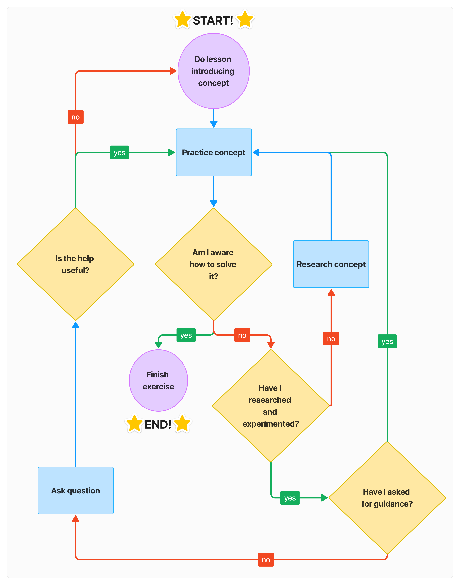

# 1. Introduction

Web developers build and maintain websites.

- Front-end developers work on the browser side.

- Back-end developers work on the server side.

- Full-stack developers work on both.

In general, to become a proper developer, one must need to learn to build projects, read documentations, and experiment with new technologies. In order to do these, one must have a **growth mindset** (i.e. a desire to improve without being afraid of failure).

The following diagram proves quite helpful for setting up a proper learning routine:

