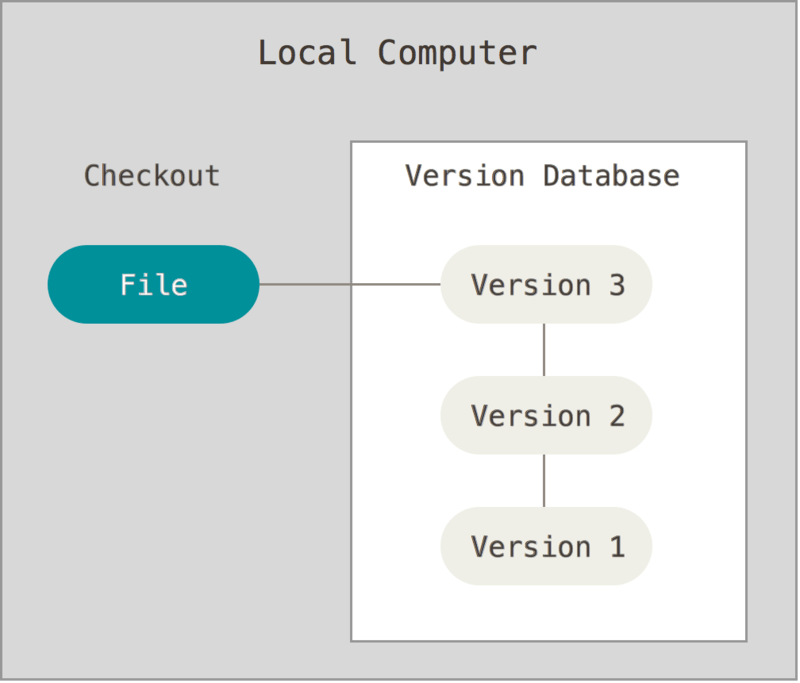
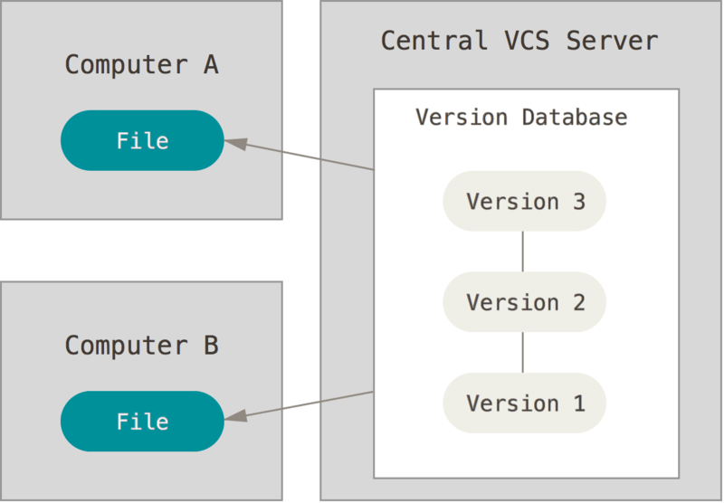
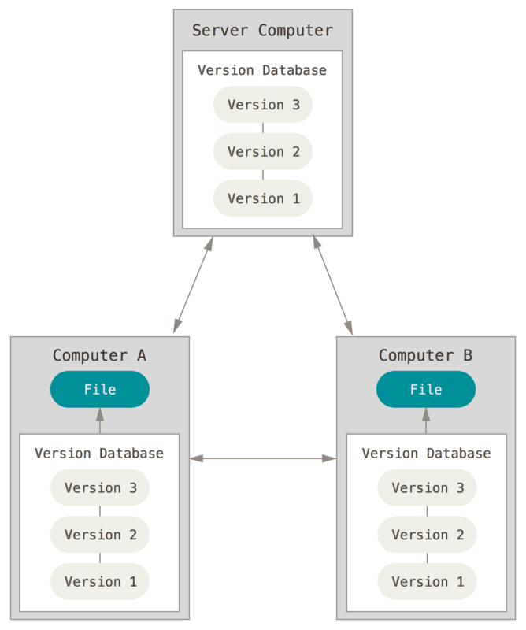
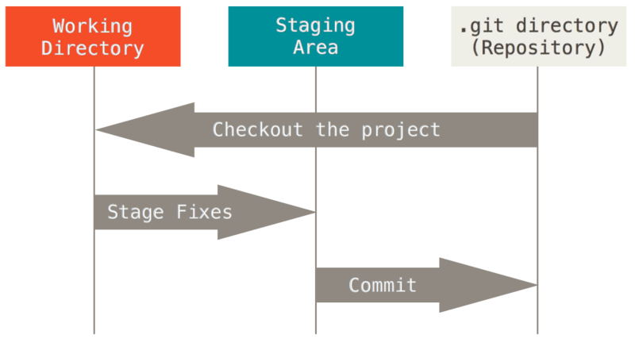

# 4. Git

**Git** is a version control system. A **version control system** (VCS) is a system that keeps track of changes made to a file or a set of files over time so that you can recall specific versions later.

There are several different types of VCSs:

- Local version control systems:

- Centralized version control systems:

- Distributed version control systems:

In a Git workflow, files can be one of three states: modified, staged, and committed.

**GitHub** is a remote storage facility built on top of Git.
