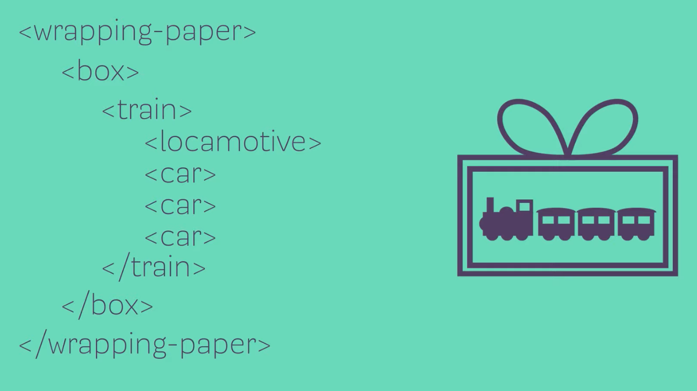

# 5. HTML & CSS

A typical web application uses HTML, CSS, and JavaScript.

- HTML (HyperText Markup Language) determines the structure and the content of a website (i.e. text, links, cards, lists, and buttons).

- CSS (Cascading Style Sheets) determines the style of a website (i.e. colors, font styles, layout and responsive features).

- JavaScript determines the functionality of a website.

## 5.1. HTML

An HTML element contains 3 parts:

- an opening tag
- some content
- a closing tag

For example, consider the following paragraph element:

```HTML
<p>some text content</p>
```

In this example,

- `<p>` is the opening tag
- `some text content` is the enclosed content
- `</p>` is the closing tag

There are some HTML elements without a closing tag, such as `<br>` or ``.

The following analogy sums up neatly how HTML elements work:



The boilerplate code for `index.html` can be generated by typing `!` and Enter:

```HTML
<!DOCTYPE html>
<html lang="en">
<head>
    <meta charset="UTF-8">
    <meta name="viewport" content="width=device-width, initial-scale=1.0">
    <title>Document</title>
</head>
<body>

</body>
</html>
```
